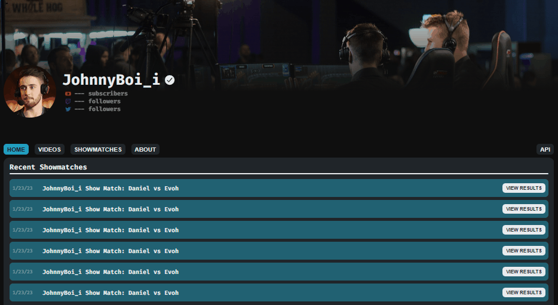

# JohnnyBoi_i Showmatches

All data is attributed to liquipedia under the [creative commons license](https://liquipedia.net/commons/Liquipedia:Copyrights).

This website uses [liquipedia's api](https://liquipedia.net/rocketleague/api.php) to fetch data from the [JohnnyBoi_i/Broadcasts](https://liquipedia.net/rocketleague/JohnnyBoi_i/Broadcasts) page and subsequent match pages.

Because of the restrictions on api calls, I can only query data **once every 30 seconds**. My solution to this problem was running [saveShowmatches.js](saveShowmatches.js) which takes the time to run through each page on the broadcasts section and parses the retrived data...waiting 30 seconds between each page query. (I know, I don't like it either)

The data retrieved is basically just the page's html, so I use the [jsdom](https://www.npmjs.com/package/jsdom) npm library to parse the html on a back-end server.

```js
const jsdom = require("jsdom");
const response = await fetch(
  `https://liquipedia.net/rocketleague/api.php?action=parse&format=json&prop=text&page=JohnnyBoi_i/Broadcasts`
);
const text = await response.json();
const dom = new jsdom.JSDOM(`${text.parse.text["*"]}`);
```

And then I do some querying of classes and id's to get the stuff I need and botta boom botta bang it's parsed into json.

## Website Demo



This is all just example text. This idea stemmed from liquipedia being so poorly designed and not having the VODs for the showmatches.

## Hosting

I use [jsonbin.io](https://jsonbin.io/) to host the json file that is generated from [saveShowmatches.js](saveShowmatches.js). I don't have this javascript file running on a server right now, but it should work to get the data from liquipedia and upload the json.

Before, I was planning on running the server myself and just saving the cached data to a file on every github commit, so then I could access that data remotely via github link, but I wanted to make it run on it's own so I can access the data a little more seamlessly.

## API Usage

My current solution for displaying this information on a website is fetching the json file from [jsonbin.io](https://jsonbin.io/) and parsing the file in my front-end application.

I don't really care, so this data is public at the moment through a **GET** request to my own api endpoint: **http://localhost:3000/api/pages** with a query param just for `page='page_name'`. If this gets too many calls though (_which I doubt it will_), I might have to limit it further.

```js
// just reading access
async function getData() {
  const response = await fetch(`http://localhost:3000/api/pages`);
  const data = await response.json();
  console.log(data);
}
```

## Response Format

```json
{
  "record": {
    "JohnnyBoi_i/Show_Match/Daniel_vs_Evoh": {
      "pageUrl": "https://liquipedia.net/rocketleague/JohnnyBoi_i/Show_Match/Daniel_vs_Evoh",
      "teamInfo": [], // this includes team info if found
      "bracketInfo": [
        {
          "participants": [
            {
              "name": "Daniel",
              "flag": {
                "link": "https://flagcdn.com/us.svg",
                "alt": "United States",
                "backlink": "https://flagpedia.net"
              }
            },
            {
              "name": "Evoh",
              "flag": {
                "link": "https://flagcdn.com/us.svg",
                "alt": "United States",
                "backlink": "https://flagpedia.net"
              }
            }
          ],
          "games": [
            { "scores": [4, 0], "map": "Mannfield (Night)" },
            { "scores": [2, 3], "map": "Mannfield (Night)" },
            { "scores": [4, 7], "map": "Mannfield (Night)" },
            { "scores": [6, 4], "map": "Mannfield (Night)" },
            { "scores": [7, 1], "map": "Mannfield (Night)" },
            { "scores": [4, 5], "map": "Mannfield (Night)- OT(+0:09)" },
            { "scores": [6, 2], "map": "Mannfield (Night)" }
          ],
          "date": "March 18, 2023 - 20:00 CET"
        }
      ],
      "placements": [
        { "place": "1st", "winnings": "Daniel", "name": "Daniel" },
        { "place": "2nd", "winnings": "Evoh", "name": "Evoh" }
      ],
      "eventInfo": {
        "series": "JohnnyBoi_i Show Match",
        "organizer": "JohnnyBoi_i",
        "type": "Online",
        "location": "North America",
        "date": "2023-03-18",
        "mode": "1v1",
        "liquipedia_tier": "Show Match (D-Tier)"
      },
      "formatInfo": "\n,1v1 Show Match\nThe match is Bo7,\n"
    }
    // ...other pages
  },
  "metadata": {
    "id": "641d2c16c0e7653a05902603",
    "private": true,
    "createdAt": "2023-03-24T04:50:30.460Z",
    "name": "JohnnyBoi Showmatches"
  }
}
```

## Sidenotes

- I wish I had access to the replay files, but because liquipedia is community sourced, they don't have access in order to upload it. I would love to have the replay files, but for now my only solution might be to query ballchasing.com and attempt to find the showmatches on there. I already know they don't have all of them, so we'll see. idk.
